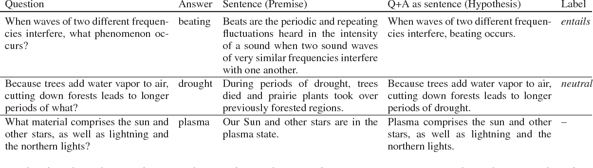
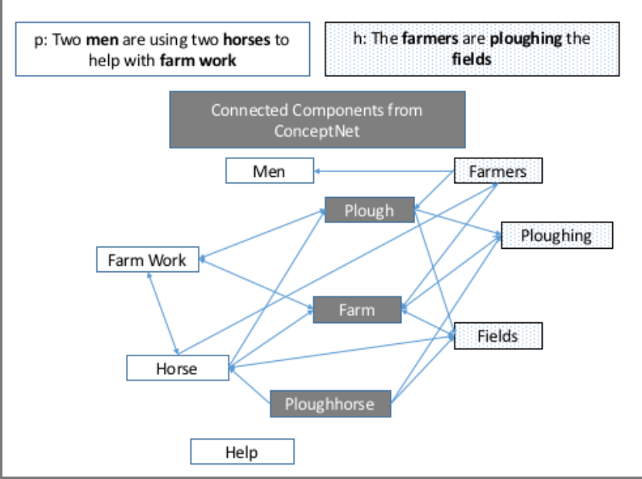
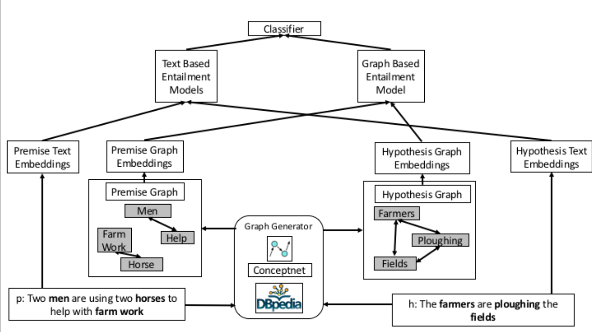

## Paper 1 : Improving Natural Language Inference Using External Knowledge in the Science Questions Domain

__Published data:__ 20 Nov 2018

__Contribution:__ 
- introduce the ConSeqNet framework, which enables the use of various kinds of ex-ternal knowledge bases to retrieve knowledge relevant to given NLI instance

__I/O Format:__ 
- Input: Passage[Premise] + Statement[Hypothesis]
- Output: True[Entailment], Flase[Contradict], Not Given[Neutral]

__Dataset:__
- SciTail: The dataset contains 27,026 examples with 10,101 examples with entails label and 16,925 examples with neutral label.

__Algorithm:__ ConSeqNet

__Model Accuracies Reached:__
85.2%

__Paper link:__ [click](https://arxiv.org/abs/1809.05724)

__Github link:__

__R & D Status:__ No

## Paper 2 : Efficient Intent Detection with Dual Sentence Encoders

__Published data:__ 10 Mar 2020

__Contribution:__ 
- Dual sentence encoders
- Faster training

__Algorithm:__ 
__I/O Format:__ 

__Dataset:__
- SciTail: The dataset contains 27,026 examples with 10,101 examples with entails label and 16,925 examples with neutral label.

__Model Accuracies Reached:__
85.2%

__Paper link:__ [click](https://arxiv.org/abs/1809.05724)

__Github link:__

__R & D Status:__ No
