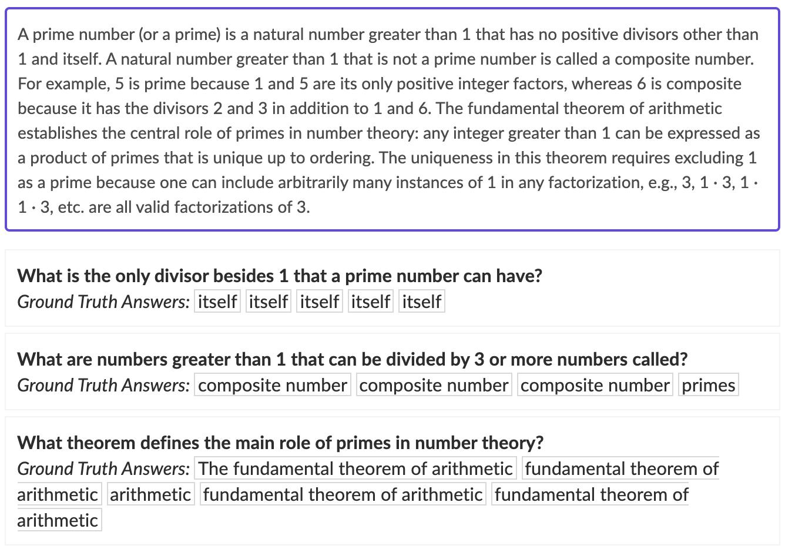
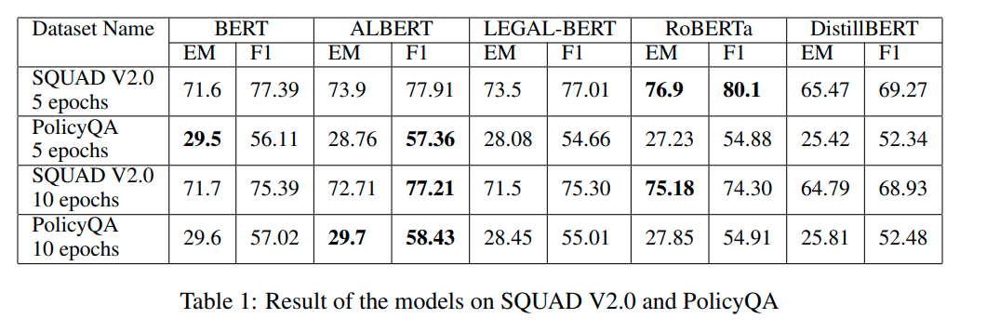
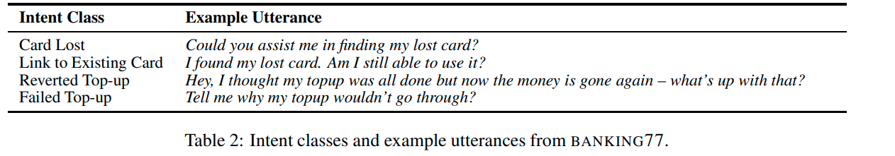
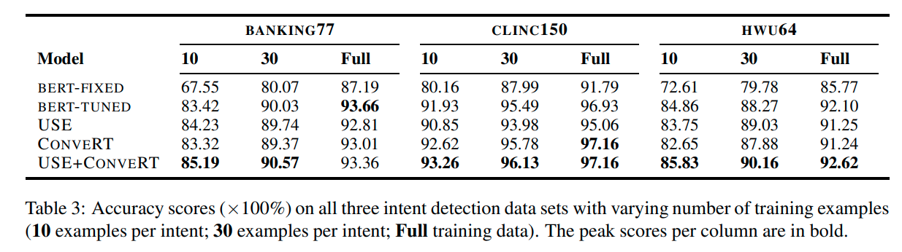

## Paper 1 : Improving Natural Language Inference Using External Knowledge in the Science Questions Domain

__Published data:__ 20 Nov 2018

__Contribution:__ 
- introduce the ConSeqNet framework, which enables the use of various kinds of ex-ternal knowledge bases to retrieve knowledge relevant to given NLI instance

__I/O Format:__ 
- <b> Input </b> : Passage[Premise] + Statement[Hypothesis]
- <b> Output </b> : True[Entailment], Flase[Contradict], Not Given[Neutral]

__Dataset:__

- [SciTail](https://allenai.org/data/scitail): The dataset contains 27,026 examples with 10,101 examples with entails label and 16,925 examples with neutral label.
- [ConceptNet](https://zenodo.org/record/1289942/files/conceptnet-distinguishing-attributes-data.zip) 
- WordNet

__Algorithm:__ ConSeqNet

- Model divided into <b> Text based model </b> & <b> Graph based model </b>
- <b> Text based model </b>
  - Context encoding[Encode using context]
  - Word by word attention[Attention of every word]
  - Matcher[Match with target]
  - Pooling[Get fixed amount of tokens]
- <b> Graph based model </b>
  - Concept embedding
  - Generate graph
  - Graph embedding
- <b> Merge Models </b>
  - Feed forward model

__Technical Details:__
Word vector dimension: 300D

__Model Accuracies Reached:__
- Train data: 89.6%
- Test data: 85.2%

__Paper link:__ [click](https://arxiv.org/abs/1809.05724)

__Github link:__

__R & D Status:__ No

## Paper 2 : Answering Legal Questions by Learning Neural Attentive Text Representation

__Published data:__ 13 Dec 2020

__Contribution:__ 
- introduced efficient text representation method
- Retrive specific articles

__I/O Format:__ 

__Dataset:__
They made custom dataset
- the legal document corpus, which contains Vietnamese legal documents
- the QA dataset, which contains a set of legal questions (queries) and a list of relevant articles for each question.

__Algorithm:__ 

Model has,
- <b> Sentence </b> encoder. Which uses CNN for filtering features and attention converts features into a representation
- <b> Paragraph </b> encoder. Which uses sentence encoder in between & converts sentence representations into a paragraph representations
- Computes <b> similarity </b> to get specific location/article

__Model Accuracies Reached:__
82.5%

__Paper link:__ [click](https://aclanthology.org/2020.coling-main.86.pdf)

__Github link:__

__R & D Status:__ No

## Paper 3 : Study of Question Answering on Legal Software Document using BERT based models

__Published data:__ June 2022

__Contribution:__ 
- Trained & tested various versions of transformer on SQaAD dataset

__I/O Format:__ 

__Dataset:__
SQuAD Dataset
PolicyQA Dataset

__Algorithm:__ 
BERT, ALBERT, LEGAL-BERT, RoBERTa, DistillBERT models

__Model Accuracies Reached:__
<b> EM </b> = Exact Match

__Paper [link](https://openreview.net/pdf?id=Xk5rh9LPvmp)__ 

__Github [link](https://github.com/Fidac/Legal-SE-BERT-Study)__

__R & D Status:__ No

## Paper 4 : Efficient Intent Detection with Dual Sentence Encoders

__Published data:__ 10 Mar 2020

__Contribution:__ 
- Dual sentence encoders
- Faster training

__I/O Format:__ 

__Algorithm:__ 
- <b> ConveRT: </b> Conversational Representations from Transformers
- <b> USE: </b> Universal Sentence Encoder
- Feed forward network to combine ConveRT & USE to get final output

__Dataset:__
- Banking77 Dataset[has 77 intents]

__Model Accuracies Reached:__
85.2%

__Paper link:__ [click](https://arxiv.org/pdf/2003.04807.pdf)

__Github link:__

__R & D Status:__ No

[//]: <> (Input/Output, Training Data, Feature Annotation, AI learning[for technical non-technical person])
