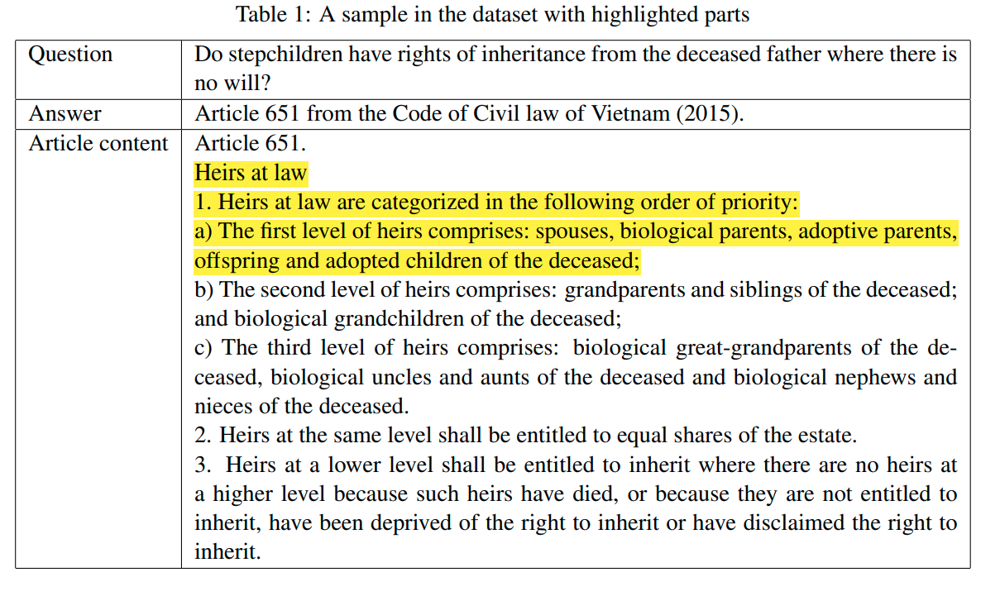
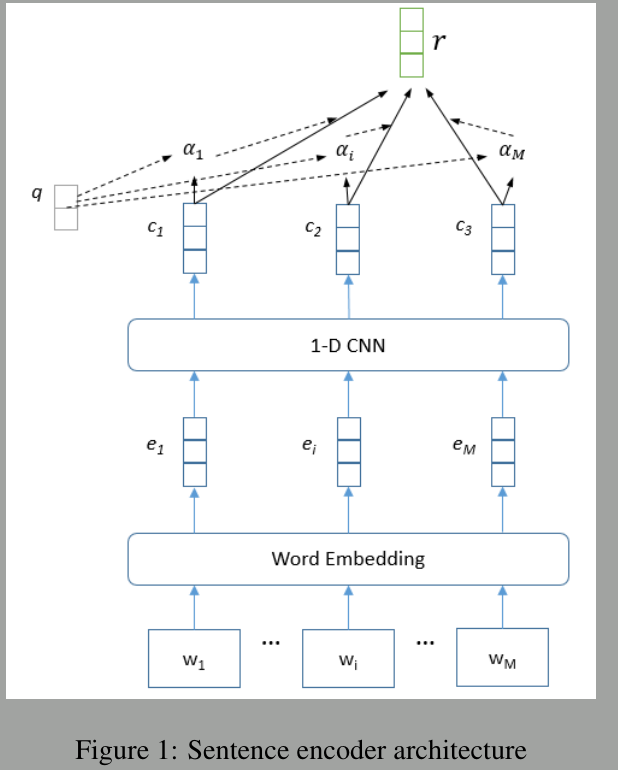
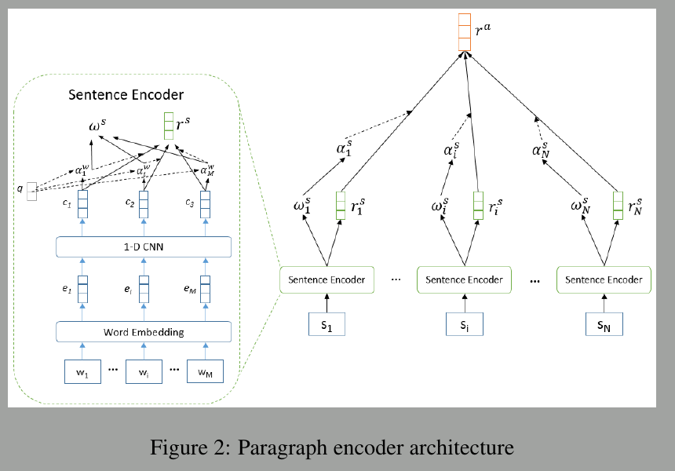

## Paper 1 : Improving Natural Language Inference Using External Knowledge in the Science Questions Domain

__Published data:__ 20 Nov 2018

__Contribution:__ 
- introduce the ConSeqNet framework, which enables the use of various kinds of ex-ternal knowledge bases to retrieve knowledge relevant to given NLI instance

__I/O Format:__ 
- <b> Input </b> : Passage[Premise] + Statement[Hypothesis]
- <b> Output </b> : True[Entailment], Flase[Contradict], Not Given[Neutral]

__Dataset:__

- [SciTail](https://allenai.org/data/scitail): The dataset contains 27,026 examples with 10,101 examples with entails label and 16,925 examples with neutral label.
- [ConceptNet](https://zenodo.org/record/1289942/files/conceptnet-distinguishing-attributes-data.zip) 

__Algorithm:__ ConSeqNet

__Github link:__

__R & D Status:__ No

## Paper 2 : Answering Legal Questions by Learning Neural Attentive Text Representation

__Published data:__ 13 Dec 2020

__Contribution:__ 
- introduced efficient text representation method
- Retrive specific articles

__I/O Format:__ 

__Dataset:__
They made custom dataset
- the legal document corpus, which contains Vietnamese legal documents
- the QA dataset, which contains a set of legal questions (queries) and a list of relevant articles for each question.

__Algorithm:__ 

- Model divided into <b> Text based model </b> & <b> Graph based model </b>
- <b> Text based model </b>
  - Context encoding[Encode using context]
  - Word by word attention[Attention of every word]
  - Matcher[Match with target]
  - Pooling[Get fixed amount of tokens]
- <b> Graph based model </b>
  - Concept embedding
  - Generate graph
  - Graph embedding
- <b> Merge Models </b>
  - Feed forward model
__Model Accuracies Reached:__
85.2%

__Paper link:__ [click](https://arxiv.org/abs/1809.05724)

__Github link:__

__R & D Status:__ No

## Paper 2 : Efficient Intent Detection with Dual Sentence Encoders

__Published data:__ 10 Mar 2020

__Contribution:__ 
- Dual sentence encoders
- Faster training

__Algorithm:__ 
__I/O Format:__ 

__Dataset:__
- SciTail: The dataset contains 27,026 examples with 10,101 examples with entails label and 16,925 examples with neutral label.

__Model Accuracies Reached:__
85.2%

__Paper link:__ [click](https://arxiv.org/abs/1809.05724)

__Github link:__

__R & D Status:__ No
